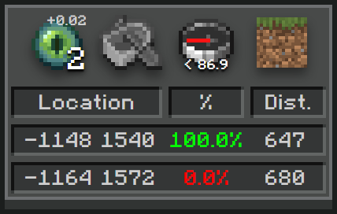

# Olof's Ninjabrain Overlay (onbo)



A Minecraft-y looking simplified interface for **[Ninjabrain Bot](https://github.com/Ninjabrain1/Ninjabrain-Bot)**.  
Perfect for having as an overlay in OBS for viewers, only showcasing the most important things.  

This was mainly built to fit the rest of my theme in OBS.  
And thus has some rough edges 

## Installation

There is a prebuilt binary for `Windows`, you can find it **[here](https://github.com/VilleOlof/onbo/releases)**.  

### Ninjabrain Bot Setup


For this to work, in your Ninjabrain bot:  
- Go to `Settings`  
- Then `Advanced`  
- And make sure `Enable API (starts HTTP server)` is enabled


### Build It Yourself
I haven't tested this at all for other systems and won't support it myself.  
One other alternative is building it yourself.  

```sh
# Assumes you have `git`, `cargo` and `npm` installed.
git clone https://github.com/VilleOlof/onbo.git
cd onbo
npm run tauri build
# then the binary is in `./src-tauri/target/onbo[.exe]`
```

## OBS Setup

When you add this as a `Window Capture`, it might just show a black box instead of the overlay.  
If so, change `Capture Method` to `Windows 10 (1903 and up)` and it will show.

## Overlay Quirks

Since this is mainly focused on just being an overlay that you put in the background.  
When there is no information to display, it will be 100% invisible.  
If you click and drag the overlay it will display a background. *(click on the overlay to toggle the background)*  
So if you can't find it on your monitor anymore, uhhh restart the overlay <3  

## Displayed Information

The information displayed is currently:
- **Eye throw count + Latest angle correction**
- **Boat status**  
    *The exact same boat as in Ninjabrain Bot*
- **The top prediction angle difference**  
    *Displays which direction you need to look towards and how many degrees.*  
    *While also displaying a visual compass, 0 angle diff is straight up ahead*
- **Latest dimension**  
    *Grass Block = Overworld, Netherrack = Nether*  
    *Bases it of the latest F3+C (player position)*
- **Top 2 predictions**  
    *And their location: x, z (depends on the dimension, will auto convert if latest F3+C was in the nether)*  
    *The certainty and the distance relative in the latest F3+C dimension*

As mentioned previous, if there is no information, the overlay will be 100% transparent.  
Otherwise if you've mismeasured it will show the same error text as in Ninjabrain Bot and your 2 latest eye throws (x, z & angle).  

It can also display the same blind information as Ninjabrain Bot when you're first pressing `F3+C` in nether.

After 3 minutes of no new information it will auto-hide itself (100% invisible).  

## Support

so uhm since this is just meant for me i wont give support for most cases.  
but i'd thought i'll publish it here incase anyone wanna touch it or test it themself.  
*Notably, this doesn't support divine or all advancements related functions*

## Inspiration

Idea came from `@yolacraft` and apparently (from them), the compass idea is from `@priffin`